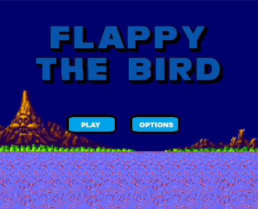
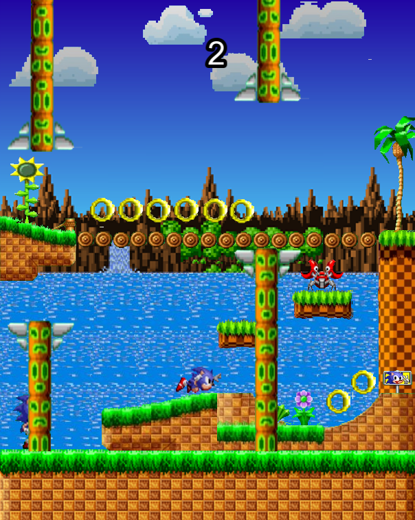
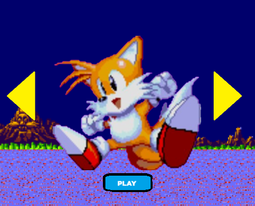
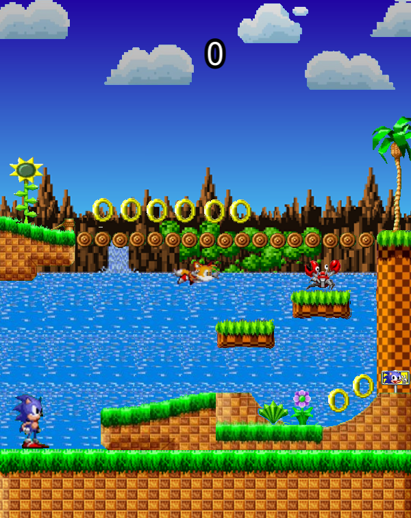

# Flappy-Bird Remake (C++ / SFML)

---



This project is a remake of the classic Flappy Bird game, based on the Sonic World, built from scratch in C++ using the SFML library.

## 🚀 Play the Game 🚀

This game is built in C++ and **cannot** be played in your browser.
You can **download the latest playable build** (for Windows, macOS, or Linux) directly from the "Releases" tab of this repository.

**[➡️ Download the Latest Release](https://github.com/julien-cassou/flappy-bird/releases/latest)**


## 🎮 Controls

* **Spacebar**: Jump
* **R**: Restart
* **Escape** : Pause

## What I Learned

* Building a 2D game from start to finish in C++.
* Managing 2D game physics (gravity, time-based impulse) for a jump mechanic.
* Implementing and animating custom sprites.
* Handling simple AABB (Axis-Aligned Bounding Box) collision detection.
* Compiling a C++ project with external dependencies (SFML) using a `Makefile`.

## 🛠️ Tech Stack

* **Language:** C++
* **Library:** **[SFML](https://www.sfml-dev.org/)** (Simple and Fast Multimedia Library) for graphics, windowing, and events.

## 👨‍💻 Build Instructions (For Developers)

If you wish to compile the project yourself:

1.  Clone the repository:
    ```bash
    git clone https://github.com/julien-cassou/flappy-bird.git
    cd flappy-bird
    ```

2.  Ensure you have the [SFML library installed](https://www.sfml-dev.org/download.php) on your machine and accessible to your compiler.

3.  Compile the project (a `Makefile` is included):
    ```bash
    make main
    ```

4.  Run the game:
    ```bash
    ./main
    ```


## Screenshots







